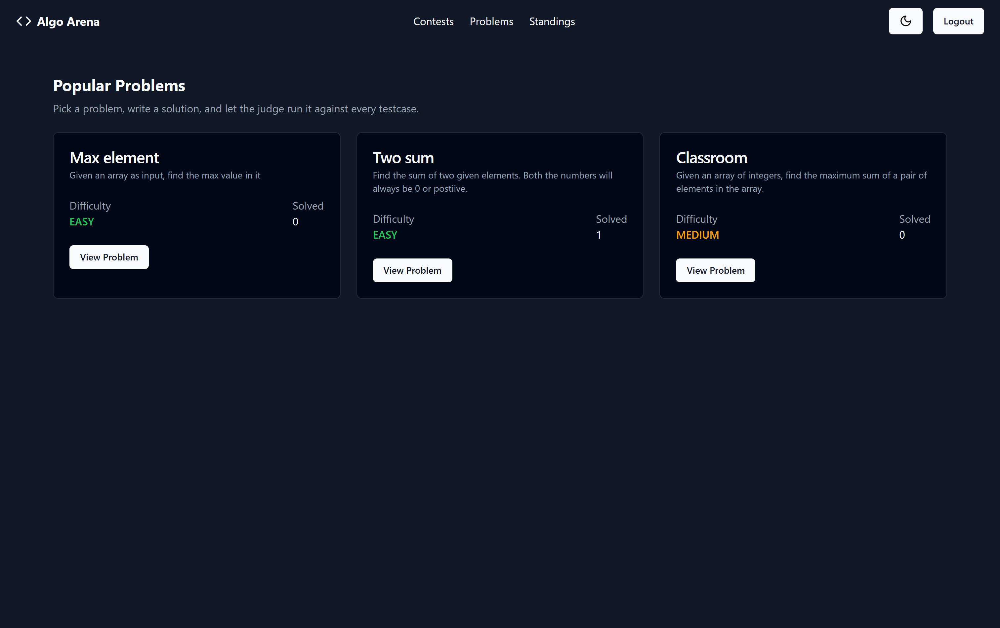
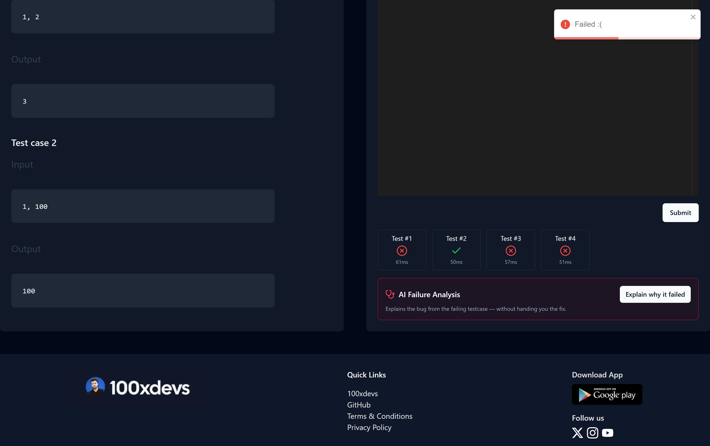
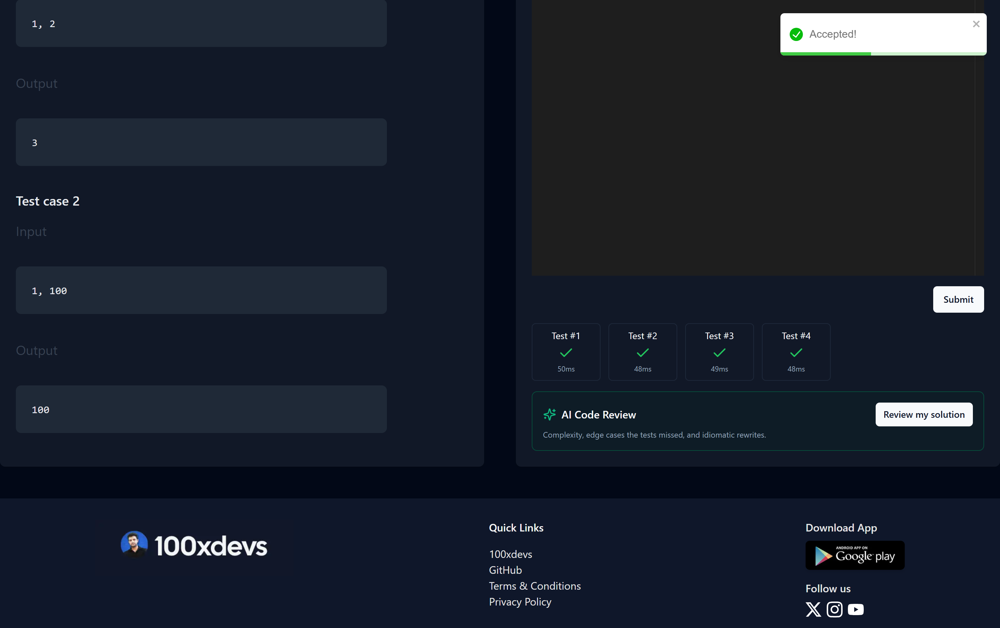
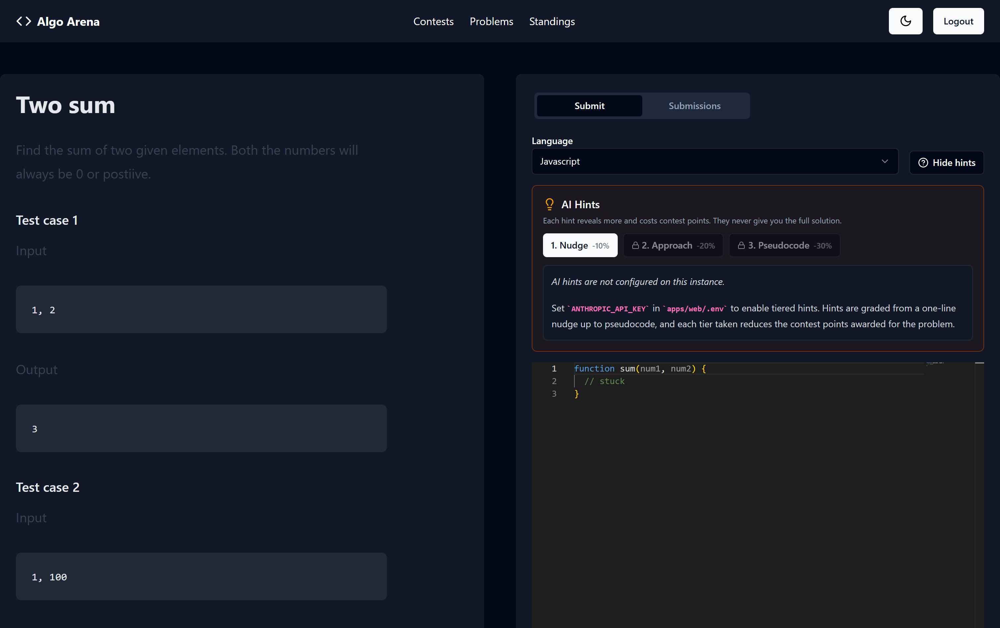
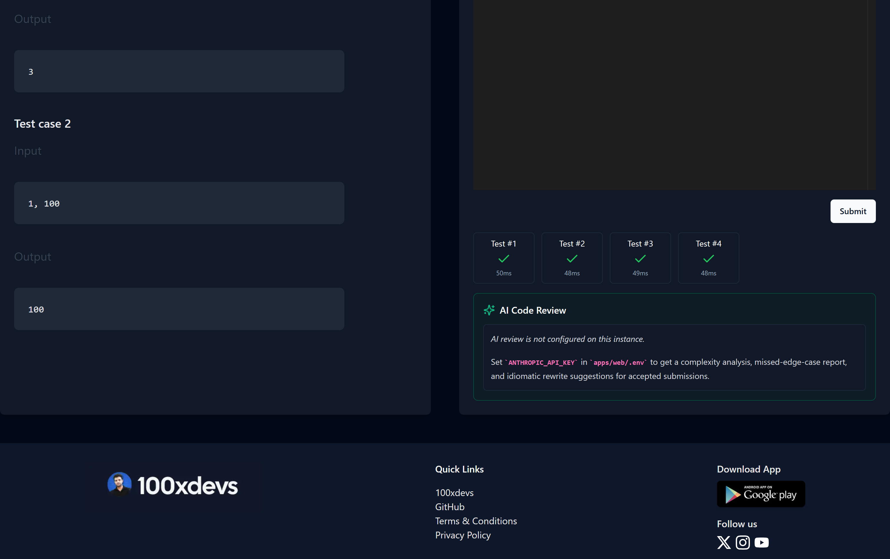

# Algo Arena

A competitive programming platform: solve problems in four languages, run timed
contests, and get an AI coach that hints without spoiling and reviews your code
after it passes.

The interesting part is the judge. Algo Arena does **not** use Judge0 — it runs
submitted code in its own throwaway Docker container per submission, with the
network cut off and hard memory, CPU, process and time limits.



<table>
<tr>
<td width="50%"><br><sub><b>Per-testcase verdicts</b> — each one timed, straight from the sandbox.</sub></td>
<td width="50%"><br><sub><b>Accepted</b> — judged synchronously, no polling.</sub></td>
</tr>
<tr>
<td width="50%"><br><sub><b>Tiered hints</b> — locked in order, priced in contest points.</sub></td>
<td width="50%"><br><sub><b>AI review</b> — complexity, missed edge cases, idiomatic rewrites.</sub></td>
</tr>
</table>

> Screenshots are generated, not hand-taken: `pnpm screenshots` drives a clean
> Chrome profile through sign-in, a failing submission, an accepted one, and
> the AI panels, and writes `docs/screenshots/`. Re-run it after a UI change
> and the README updates itself.

---

## What is in the box

| Path | What it is |
|---|---|
| `apps/web` | Next.js 14 app — problems, contests, standings, Monaco editor, AI panels |
| `apps/judge` | **The sandbox.** HTTP service that compiles and runs submissions in Docker |
| `apps/problems` | Problems as directories: statement, boilerplate, testcases |
| `apps/boilerplate-generator` | Turns a `Structure.md` into per-language boilerplate |
| `apps/leaderboard-generator` | Computes contest rankings |
| `packages/ai` | Claude integration — prompts, streaming, cost accounting |
| `packages/db` | Prisma schema, migrations, seeder |
| `packages/common` | Types shared between the web app and the judge |
| `packages/ui` | shadcn/ui components |

---

## Quick start

You need **Docker Desktop** (running), **Node 18+**, and **pnpm**.

```bash
# 1. Install dependencies
pnpm install

# 2. Start Postgres and Redis
docker compose up -d

# 3. Copy the env files
cp apps/web/.env.example apps/web/.env
cp packages/db/.env.example packages/db/.env
cp apps/judge/.env.example apps/judge/.env

# 4. Create the schema and load the problems
cd packages/db && pnpm db:migrate && pnpm db:seed && cd ../..

# 5. Check that the sandbox works (pulls images on first run, ~2 min)
pnpm judge:doctor

# 6. Run everything
pnpm dev
```

Open <http://localhost:3000>. There is no separate sign-up page — enter any
email and password on the sign-in screen and an account is created.

`pnpm dev` starts the web app on `:3000` and the judge on `:4000`.

### Step 5 should print this

```
Docker available: yes
+ JavaScript  AC  72ms run, 9068KB peak, 534ms wall
+ C++         AC  22ms run, 43872KB peak, 801ms wall
+ Java        AC  128ms run, 54592KB peak, 1551ms wall
+ Rust        AC  25ms run, 37124KB peak, 1200ms wall

All good.
```

If it says `Docker available: no`, start Docker Desktop and run it again.

---

## Turning on the AI features

The AI features are optional. Without a key they return a short "not
configured" message instead of failing, so the rest of the app still works.

Put an [Anthropic API key](https://console.anthropic.com/) in `apps/web/.env`:

```bash
ANTHROPIC_API_KEY=sk-ant-...
```

Restart `pnpm dev`. That is the whole setup.

---

## How code actually gets executed

Judge0 is the usual answer for this kind of project, and this repo used to use
it. It was removed because:

- **It needs cgroup v1.** Docker Desktop is cgroup v2, so every submission came
  back `status_id 13 — Internal Error`. It cannot run on a modern Windows or
  Mac dev machine.
- **It needs privileged containers** and a bind mount of the problems directory
  into the sandbox, with Windows path rewriting to make the mount work.
- **It is a second database.** Judge0 wrote to its own Postgres tables, which
  had to be mirrored into this project's Prisma schema, and a separate
  `sweeper` process polled those tables once a second to notice when a
  submission had finished.

`apps/judge` replaces all of it. One submission is one container:

```
POST /execute  { language, sourceCode, testcases[] }
      │
      ▼
 write source + input_0.txt … input_N.txt to a temp dir
      │
      ▼
 docker run --rm
   --network none                 no network, at all
   --memory 256m --memory-swap    a real cap, not just a soft one
   --cpus 1 --pids-limit 128      no fork bombs
   --cap-drop ALL                 no capabilities
   --security-opt no-new-privileges
   --read-only --tmpfs /tmp       only the mount and /tmp are writable
   -v <tempdir>:/box
      │
      ▼
 compile once, then run against each testcase with `timeout -s KILL`
      │
      ▼
 { verdict, testcases[{ status, timeMs, memoryKb, stdout, stderr }] }
```

Compiling once and looping over testcases inside a single container is what
keeps it fast: a container start costs ~400ms, which would otherwise be paid
per testcase rather than per submission.

Verdicts are `AC`, `WA`, `TLE`, `MLE`, `RE`, `CE`, `IE`. Timing comes from
`date +%s%N` inside the sandbox; peak memory is read from the container's own
`memory.peak` cgroup file.

**Judging is synchronous.** The endpoint returns a final verdict, so there is
no queue to poll and no sweeper process.

### No Docker?

The judge falls back to running code as a plain subprocess, for whichever
languages are on your PATH. This has **no sandboxing at all** — it exists so
the app still runs for local development. It is disabled when
`NODE_ENV=production` unless you set `JUDGE_ALLOW_SUBPROCESS=true`.

### Languages

| Language | Image | Compile | Run |
|---|---|---|---|
| JavaScript | `node:22-slim` | — | `node Main.js` |
| C++ | `gcc:13` | `g++ -O2 -std=c++17` | `./Main` |
| Java | `eclipse-temurin:21-jdk` | `javac Main.java` | `java -XX:+UseSerialGC Main` |
| Rust | `rust:1-slim` | `rustc -O` | `./Main` |

---

## The AI features

All three stream their answer token by token, are cached so the same request
is never paid for twice, and are rate limited per user. Every call is logged
to `AiInteraction` with its token counts, so what the features cost is a SQL
query rather than a guess.

### 1. Tiered hints — and they cost you points

Three tiers, unlocked in order:

| Tier | Gives you | Contest penalty |
|---|---|---|
| 1. Nudge | One or two sentences pointing at the key observation | −10% |
| 2. Approach | The technique, the data structure, and the plan. No code. | −20% |
| 3. Pseudocode | Language-agnostic pseudocode, deliberately incomplete | −30% |

The penalties stack, capped at −60%. `awardContestPoints` reads the hints you
unlocked for that problem and scales the award down. Re-reading a hint you
already own is free and does not call the model again.

The prompt is given your **current editor contents**, so a hint responds to the
approach you are actually taking instead of redirecting you to a canonical one.
No tier will write you a working solution.

### 2. Code review, after you pass

On an accepted submission: time and space complexity with justification, edge
cases the testcases happened not to catch, idiomatic rewrites with before/after
snippets, and a verdict on whether it would pass an interview.

### 3. Failure analysis, when you don't

On a failed submission, built around the first failing testcase: what class of
bug it is, a concrete trace of what your code does on that specific input, and
a question to ask yourself. It is explicitly instructed never to hand over the
corrected code.

Model and effort per feature live in `packages/ai/src/config.ts`.

---

## Adding a problem

A problem is a directory under `apps/problems/`:

```
apps/problems/my-problem/
  Problem.md          statement (markdown). "Difficulty: EASY|MEDIUM|HARD" sets the difficulty
  Structure.md        function signature, used to generate boilerplate
  tests/inputs/0.txt  testcase inputs,  numbered from 0
  tests/outputs/0.txt expected outputs, matching filenames
```

`Structure.md` looks like this:

```
Problem Name: "Two Sum"
Function Name: sum
Input Structure:
Input Field: int num1
Input Field: int num2
Output Structure:
Output Field: int result
```

Then:

```bash
cd apps/boilerplate-generator && pnpm boiler:generate   # writes boilerplate/ and boilerplate-full/
cd ../../packages/db && pnpm db:seed                    # loads it into the database
```

`boilerplate/` is what the solver sees in the editor. `boilerplate-full/` is
the harness that reads the testcase from **stdin**, calls the solver's
function, and prints the result.

---

## Common problems

| Symptom | Fix |
|---|---|
| `Cannot reach the judge service at http://localhost:4000` | The judge is not running. `pnpm dev`, or `cd apps/judge && pnpm dev`. |
| `pnpm judge:doctor` says `Docker available: no` | Start Docker Desktop and wait for the whale icon to settle. |
| Every submission is `Internal Error` | Run `pnpm judge:doctor` — usually a missing image. It pulls them. |
| Submissions return 429 | The rate limiter allows one submission per 10 seconds per user. |
| AI panels say "not configured" | Set `ANTHROPIC_API_KEY` in `apps/web/.env` and restart. |
| `prisma migrate` cannot connect | `docker compose up -d`, then check `packages/db/.env`. |
| Problem files "missing or malformed" | Set `MOUNT_PATH` in `apps/web/.env` to the absolute path of `apps/problems`. |

---

## Environment variables

Everything optional degrades rather than crashes: no `REDIS_URL` disables rate
limiting, no `ANTHROPIC_API_KEY` disables the AI panels, no
`CLOUDFLARE_TURNSTILE_SECRET_KEY` disables the bot check.

| Variable | Where | Purpose |
|---|---|---|
| `DATABASE_URL` | web, db | Postgres connection string |
| `NEXTAUTH_SECRET`, `JWT_SECRET` | web | Session signing |
| `JUDGE_URL` | web | Where the judge lives (default `http://localhost:4000`) |
| `JUDGE_TOKEN` | web, judge | Shared secret. Must match on both sides. |
| `MOUNT_PATH` | web, db | Absolute path to `apps/problems` |
| `REDIS_URL` | web | Rate limiting |
| `ANTHROPIC_API_KEY` | web | AI features |
| `ANTHROPIC_MODEL` | web | Defaults to `claude-opus-5` |
| `JUDGE_CONCURRENCY` | judge | Simultaneous sandboxes (default 4) |
| `JUDGE_TIME_LIMIT_MS` | judge | Per-testcase limit (default 5000) |
| `JUDGE_MEMORY_LIMIT_MB` | judge | Per-submission limit (default 256) |
| `JUDGE_ALLOW_SUBPROCESS` | judge | Allow the unsandboxed fallback |

---

## Tech

Next.js 14 · TypeScript · Prisma · PostgreSQL · Redis · Docker · Turborepo ·
Tailwind · shadcn/ui · Monaco · NextAuth · Anthropic Claude
